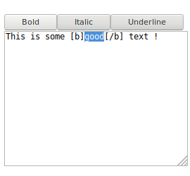

# jQuery-textWrapper

A jQuery plugin to wrap text in a textarea with custom tags


## Installation

`npm install jquery-text-wrapper`

## Usage

You can see this example in a file in `example/index.html`

```html
<!DOCTYPE html>
<html lang="en">
    <head>
        <meta charset="UTF-8">
        <title>Homepage</title>
    </head>
    <body>
        <div id="button-container">

        </div>
        <textarea id="textarea" rows="10" cols="30"></textarea>

        <!-- Don't forget to include jQuery ! -->
        <script src="node_modules/jquery/dist/jquery.js"></script>
        <script src="node_modules/jquery-text-wrapper/dist/jquery-textWrapper.min.js"></script>

        <script type="text/javascript">
            $(document).ready(function() {
              // You can use default definitions through your app
              $.fn.textWrapper.defaults = {
                definitions: [
                  {
                    startTag: "[b]",
                    endTag: "[/b]",
                    label: "Bold",
                    shortcut: "CTRL+B",
                    attr: {
                      // Setting custom class on the button
                      className: "btn btn-secondary"
                    }
                  },
                  {
                    startTag: "[i]",
                    endTag: "[/i]",
                    label: "Italic",
                    attr: {
                      className: "btn btn-secondary"
                    }
                  },
                ]
              };

              // And add new one on the fly !
              $("#textarea").textWrapper({
                definitions: [
                  {
                    startTag: "[u]",
                    endTag: "[/u]",
                    label: "Underline",
                    attr: {
                      className: "btn btn-secondary"
                    }
                  }
                ],
                buttonContainer: $("#button-container")
              })
            })
        </script>
    </body>
</html>
```